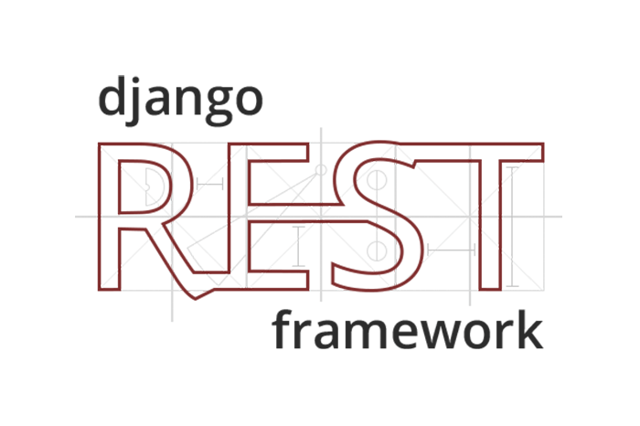

**A simple crm that is built with Django REST framework**

## Technology Stack

- [Python 3.8.4](https://www.python.org/) , Programming Language. [](https://img.shields.io/badge/python-3.9-red)
- [Django 4.1](https://docs.djangoproject.com/en/3.2/releases/3.2/) , Web Framework.
- [Django Rest Framework 3.13.1](https://www.django-rest-framework.org/) , API Framework.
- [Simple JWT](https://django-rest-framework-simplejwt.readthedocs.io/en/latest/), JSON Web Tokens.
- [Djoser](https://djoser.readthedocs.io/en/latest/introduction.html) , Views for authentication system.
- [PostgreSQL](https://www.postgresql.org/) , Database.

## Setup

Clone the project

```bash
  git clone git@github.com:Hosseinht/drf-simplecrm.git
```

Go to the project directory

```bash
  cd my-project
```

Install dependencies

```bash
  pip install -r requirements.txt
```

.env File

```bash
    make a .env file with required fields. check .env.example for the needed fields
```

Migrate

```bash
  python manage.py migrate
```

Start server

```bash
  python manage.py runserver
```

## Setup on Docker
**First install the Docker**
- [install Docker in Linux](https://docs.docker.com/engine/install/)
- [install Docker in Windows](https://docs.docker.com/desktop/windows/install/)
- [install Docker in Mac](https://docs.docker.com/desktop/mac/install/)

**docker-compose**
- [install docker-compose](https://docs.docker.com/compose/install/)

**Build and run the app**
```shell
docker-compose up -d --build
```

## Endpoints
http://127.0.0.1/api/leads/

http://127.0.0.1/api/categories/

**Djoser endpoints for authentication**

[Djoser Endpoints](https://djoser.readthedocs.io/en/latest/getting_started.html)

http://127.0.0.1/api/auth/

